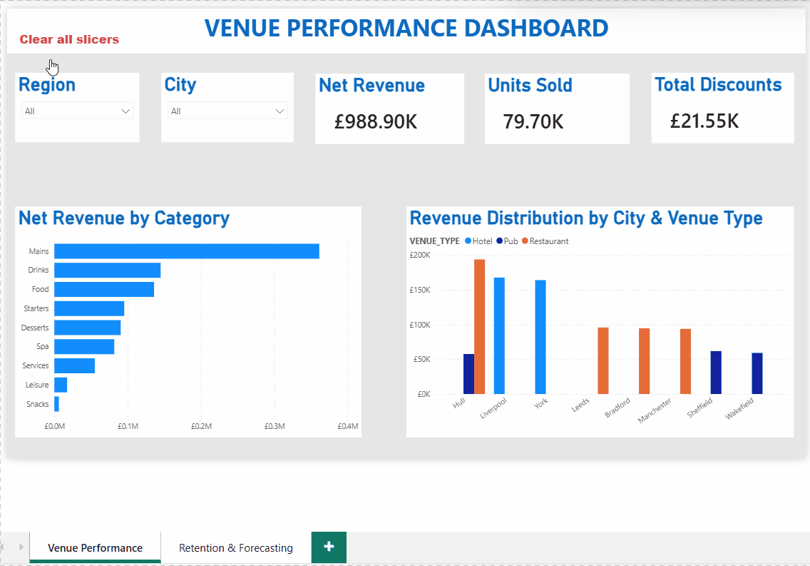
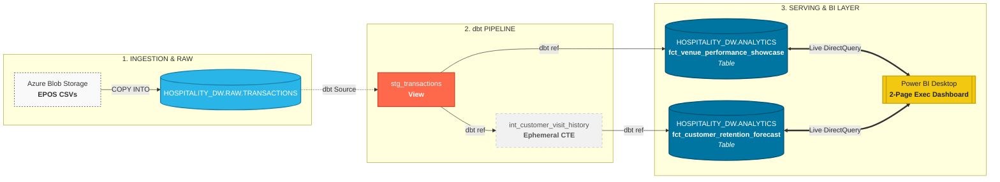
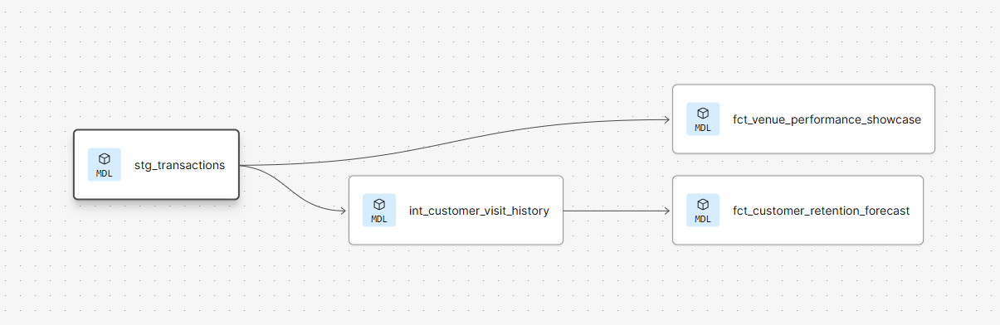
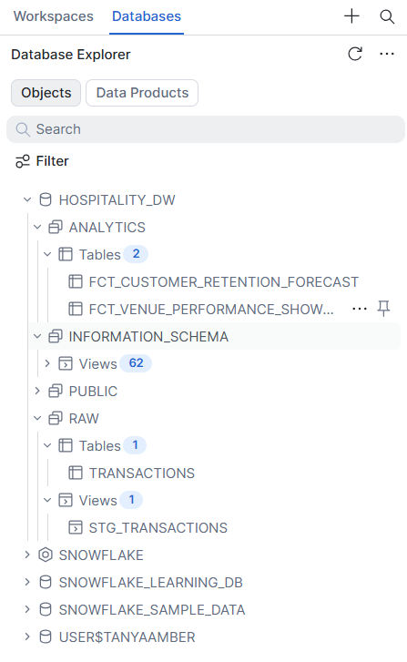

# 📊 Hospitality EPOS Data Platform
### End-to-End Modern Data Stack | Snowflake • dbt Cloud • Power BI

<p align="center">

[](https://www.snowflake.com/)
[](https://www.getdbt.com/)
[](https://powerbi.microsoft.com/)

</p>

---

## 🎨 Interactive Product Showcase

### 🎥 Live Dashboard Demo

 

### 📸 Executive Dashboard Pages
| Page 1: Executive Venue Performance | Page 2: Guest Retention & Value Forecast |
|:---:|:---:|
|  |  |

---

## 🏗️ Platform Architecture & Lineage

### ⚡ Technical Solution Diagram
*Azure ➡️ Snowflake RAW ➡️ dbt (Staging/Int/Marts) ➡️ Power BI.*


### 🧪 dbt Model Lineage Graph
*Take a screenshot of the Directed Acyclic Graph (DAG) from your dbt Cloud lineage pane to visually prove your model relationships.*
 

### 📈 Snowflake Schema Diagram
*Take a screenshot or map out the generated tables inside the `HOSPITALITY_DW.ANALYTICS` schema.*
 

---

## 📖 Project Overview

This project demonstrates the design and implementation of an **enterprise-grade analytics platform** for hospitality and restaurant EPOS (Electronic Point of Sale) transaction records using a modern cloud data stack.

The platform ingests raw transactional data from source systems, processes it through a modular dbt pipeline using **dbt Cloud**, stores the curated data inside **Snowflake**, and exposes business-intelligence-ready data marts to interactive **Power BI Desktop** executive dashboards via live **DirectQuery** connections.

---

## 🚀 Quick Start & Deployment

### 1. Prerequisites
* A **Snowflake** account with `SYSADMIN` privileges.
* A **dbt Cloud** developer account connected to your data warehouse.
* **Power BI Desktop** installed locally.

### 2. Warehouse Ingestion
Run your initial structural setup scripts to land data inside `HOSPITALITY_DW.RAW.TRANSACTIONS`.

### 3. Pipeline Execution
Navigate to your dbt Cloud terminal and initialize the dependencies and transformation layers:
```bash
dbt deps
dbt seed
dbt run
```

## 3. BI Visual Initialization

Open the localized `.pbix` file template inside your repository, specify
your Snowflake server account credentials when prompted, and opt for
**DirectQuery** to enable live database cross-filtering.

------------------------------------------------------------------------

# 📂 Data Warehouse Architecture

The project follows a layered data warehouse architecture that separates
ingestion, transformation, and presentation responsibilities.

## 🔹 Raw Layer

**Schema:** `HOSPITALITY_DW.RAW`

-   Stores the immutable, historical ingestion table (`TRANSACTIONS`)
    landed from source datasets.
-   Preserves raw record integrity without modifying physical rows.

------------------------------------------------------------------------

## 🔹 Staging Layer

**Materialization:** `view`\
**Location:** `models/staging/`

-   Enforces structural cast types (such as forcing string
    representations into clean numerics).
-   Standardizes field names and shapes to fit enterprise guidelines.

------------------------------------------------------------------------

## 🔹 Intermediate Layer

**Materialization:** `ephemeral`\
**Location:** `models/intermediate/`

Implements core customer tracking logic and chronological sequencing.

Computes unique **Customer Surrogate IDs** generated using a
deterministic **MD5 hash**:

``` sql
md5(payment_method || city || venue_type)
```

Advanced SQL window functions track chronological behaviors without
hitting physical storage:

``` sql
row_number() over (
    partition by customer_surrogate_id
    order by transaction_ts
) as customer_visit_number,

lag(transaction_ts) over (
    partition by customer_surrogate_id
    order by transaction_ts
) as previous_visit_ts
```

------------------------------------------------------------------------

## 🔹 Analytics Layer (Data Marts)

**Schema:** `HOSPITALITY_DW.ANALYTICS`\
**Materialization:** `table`

### 📈 `fct_customer_retention_forecast`

Tailored for marketing directors and growth strategists to analyze
customer loyalty life cycles, repeat booking rates, and project future
revenue gains.

### 📊 `fct_venue_performance_showcase`

Built for executive operational dashboards to visualize macro
transactional performance across physical locations, categories, and
venue types.

------------------------------------------------------------------------

# 🚀 Engineering Highlights & Wins

-   **⚙️ Custom dbt Schema Override Macro:** Overrode dbt's native
    runtime environment mapping with a custom `generate_schema_name.sql`
    macro to cleanly strip target prefixes, dropping staging models into
    `RAW` and finalized serving tables directly into `ANALYTICS`.
-   **🔒 Snowflake Least-Privilege Role Security:** Configured robust
    Role-Based Access Controls (RBAC), transferring table ownership
    structures safely from administrative tiers down to production
    execution roles.
-   **⚡ DirectQuery Optimization:** Configured Power BI with a live
    DirectQuery connector to push heavy data warehouse aggregates onto
    Snowflake clusters, removing local client processing bottlenecks.

------------------------------------------------------------------------

# 🛠️ Technology Stack

  Category                Technology
  ----------------------- ------------------------------
  Cloud Storage           Azure Blob Storage
  Data Warehouse          Snowflake
  Compute Warehouse       COMPUTE_WH (`SYSADMIN` Role)
  Transformation Engine   dbt Cloud
  Analytics Language      SQL (Snowflake Dialect)
  BI Platform             Power BI Desktop
  Connection Protocol     DirectQuery
  Version Control         Git, GitHub Desktop & GitHub

------------------------------------------------------------------------

# 📁 Repository Structure

``` text
hospitality-epos-data-pipeline/
│
├── models/
│   ├── staging/
│   │   ├── src_hospitality.yml
│   │   └── stg_transactions.sql
│   ├── intermediate/
│   │   └── int_customer_visit_history.sql
│   └── marts/
│       ├── fct_customer_retention_forecast.sql
│       └── fct_venue_performance_showcase.sql
├── macros/
│   └── generate_schema_name.sql
├── images/
│   ├── venue_performance.png
│   ├── retention_analysis.png
│   ├── dbt_lineage.png
│   └── snowflake_schema.png
├── docs/
├── engineering_journal.md
└── README.md
```

------------------------------------------------------------------------

# 🎯 Skills Demonstrated

-   Modern Data Stack Architectures (Snowflake + dbt Cloud + Power BI)
-   Dimensional Modeling & ELT Designs (Staging, Ephemeral, Mart layers)
-   Advanced SQL Analytics (Cryptographic Hashing, Windows partition
    logic, dynamic sequencing)
-   Cloud Security and RBAC (Privilege transfers, Sysadmin environments,
    least-privilege schemas)
-   DirectQuery Dashboard Optimization (Slicers, Custom button actions,
    clear hierarchy UX)
-   Engineering Version Control (Git, branching, merging, GitHub Desktop
    flow)
