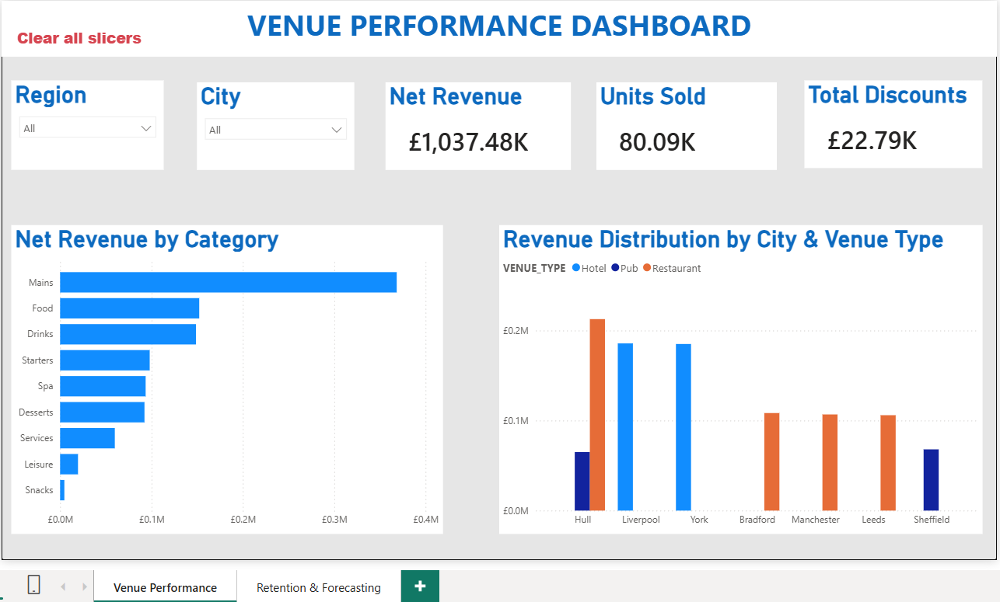
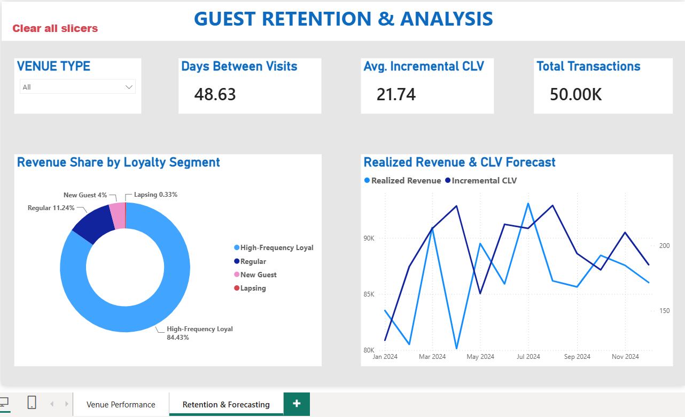

# 📔 Hospitality Data Platform: Project Engineering Journal & Knowledge Base

**Author:** Tanya Amber\
**Target Architecture:** Azure Blob Storage ➡️ Snowflake ➡️ dbt Cloud ➡️
Power BI

------------------------------------------------------------------------

## 🗺️ 1. Global Architectural Overview & Intent

The goal of this project was to engineer an enterprise-grade, three-tier
data platform for a hospitality EPOS (Electronic Point of Sale)
ecosystem tracking restaurant and venue transactions.

The architecture enforces a strict **separation of concerns**: 1. **Raw
Storage Tier (`HOSPITALITY_DW.RAW`)**: Holds immutable, historical
ingestion tables (`TRANSACTIONS`) landed from source systems. 2.
**Transformation Tier (dbt Cloud)**: Processes raw rows through a
modular Staging ➡️ Intermediate ➡️ Marts DAG (Directed Acyclic Graph)
structure without altering data on disk. 3. **Analytics Serving Tier
(`HOSPITALITY_DW.ANALYTICS`)**: Exposes clean, highly aggregated
business-intelligence-ready tables optimized for fast dashboard
rendering.

------------------------------------------------------------------------

## 🏗️ 2. The Multi-Tier dbt Model Architecture

To scale data transformations cleanly, we split our logic across
distinct directories under `models/`:

### A. Staging Layer (`models/staging/stg_transactions.sql`)

-   **Purpose:** Acts as the clean boundary layer. It applies structural
    cast types (e.g., forcing string numbers into proper numbers) and
    standardizes field names while keeping grain 1:1 with source files.
-   **Materialization:** `view`. It does not store physical data; it
    points directly back to raw storage to conserve computational
    resources.

### B. Intermediate Layer (`models/intermediate/int_customer_visit_history.sql`)

-   **Purpose:** Implements complex business logic. Here, we built a
    **Customer Surrogate ID** by hashing identifying properties
    (`md5(payment_method || city || venue_type)`), used window functions
    (`row_number()` and `lag()`) to map out chronological customer visit
    numbers, calculated the days elapsed between consecutive guest
    visits, and dynamically assigned loyalty segments.
-   **Materialization:** `ephemeral`. It compiles as a virtual nested
    CTE directly inside the downstream model. It does not exist as an
    independent database object in Snowflake, saving cost and clutter.

### C. Marts Layer (The Dual Analytical Engines)

To support both advanced customer analytics and macro operational
visibility, the final serving layer split into two specialized
endpoints:

#### 1. High-Level Analysis Mart (`models/marts/fct_customer_retention_forecast.sql`)

-   **Purpose:** Built to calculate customer loyalty lifecycles,
    frequency trends, and cohort-based behavioral retention metrics for
    long-term forecasting.
-   **Materialization:** `table`. Writes physical blocks to Snowflake
    disk storage to guarantee lightning-fast load times.

#### 2. General Showcase Performance Mart (`models/marts/fct_venue_performance_showcase.sql`)

-   **Purpose:** Aggregates macro operational performance data (total
    units sold, total transactions, gross vs. net revenues, and average
    item costs) grouped across geographical locations and product
    category dimensions for high-level executive visualization.
-   **Materialization:** `table`. Deploys alongside the forecasting mart
    to serve as a fast performance-reporting engine.

------------------------------------------------------------------------

## 🚧 3. Hurdles Encountered, Errors, & Diagnostic Fixes

### 🥊 Hurdle 1: The Case-Sensitive Snowflake Warehouse Name Mismatch

-   **The Error:**
    `Database 'HOSPITALITY_DB' does not exist or not authorized.`
-   **What Caused It:** dbt was configured to search for a source
    database named `HOSPITALITY_DB`. However, the underlying data
    warehouse in Snowflake was actually named `HOSPITALITY_DW` (Data
    Warehouse). Because Snowflake treats identifiers strictly, this
    single-character divergence completely blocked connection
    handshakes.
-   **The Fix:** Modified `src_hospitality.yml` to explicitly reference
    `database: HOSPITALITY_DW`, aligning dbt's map with Snowflake's
    ground truth.

### 🥊 Hurdle 2: The UI Saving Illusion & Git Branch Protection Trap

-   **The Error:** Despite changing code in the editor, consecutive
    `dbt run` commands continued to output errors referencing old
    database locations.
-   **What Caused It:** Two hidden UI blockades occurred simultaneously:
    1.  The code modifications had not been universally saved to the
        cloud compilation server by pressing the global **Save** button
        in the top right window.
    2.  The workspace was locked into the **`main` branch**. In dbt
        Cloud, the `main` branch is protected with a padlock icon
        (`main 🔒`). It strictly runs the last deployed production code
        cache, totally ignoring active on-screen code edits.
-   **The Fix:** Created a dedicated developer branch called **`dev`**,
    typed an explicit commit message summarizing changes, clicked
    **Commit Changes**, and unlocked true execution paths.

### 🥊 Hurdle 3: The Empty Connection Profile Credentials

-   **The Error:** Compilations stubbornly defaulted back to looking for
    a database called `RAW`, ignoring explicitly written paths in code.
-   **What Caused It:** Looking into
    `Tanya Amber ➡️ Profile Settings ➡️ Connection Details`, the fields
    for **Role**, **Database**, and **Warehouse** were completely
    unpopulated (`--`). Without explicit directions, dbt fell back to
    internal default placeholders (`RAW`), triggering compilation
    failures.
-   **The Fix:** Populated the user profile fields with exact corporate
    parameters:
    -   **Role:** `SYSADMIN` (granted the rights to build views)
    -   **Database:** `HOSPITALITY_DW`
    -   **Warehouse:** `COMPUTE_WH`

### 🥊 Hurdle 4: The Ownership vs. Grant Permission Misunderstanding

-   **The Symptom:** Running SQL scripts to grant access did not alter
    the schema's owner column from `ACCOUNTADMIN` to `SYSADMIN`.
-   **What Caused It:** Running a `GRANT USAGE` or `GRANT SELECT`
    statement gives another role permission to *read/write data*, but it
    **does not** modify the object's legal owner. The original role
    (`ACCOUNTADMIN`) retained structural control.
-   **The Fix:** Executed an explicit ownership transfer statement
    within the Snowflake console to pass administrative power down to
    dbt's operating role:
    `GRANT OWNERSHIP ON SCHEMA HOSPITALITY_DW.RAW TO ROLE SYSADMIN COPY CURRENT GRANTS;`

### 🥊 Hurdle 5: Missing Column Upstream (Invalid Identifier)

-   **The Error:**
    `SQL compilation error: invalid identifier 'VENUE_TYPE'` in
    `fct_customer_retention_forecast.sql`.
-   **What Caused It:** The final analytical forecasting model was
    trying to group rows by a column named `VENUE_TYPE`. However, while
    `VENUE_TYPE` existed in the base staging file, it was accidentally
    excluded from the final `select` statement of the intermediate
    (`int_customer_visit_history.sql`) model. The pipeline broke because
    the chain of data was cut in the middle.
-   **The Fix:** Added `venue_type` explicitly into the intermediate
    model's CTE selection and its final trailing select list, allowing
    the dimension to flow seamlessly up the data pipeline.

### 🥊 Hurdle 6: Plural Materialization Syntax Error

-   **The Error:**
    `Materialization macro not found for materialization: tables`
-   **What Caused It:** A typo in `dbt_project.yml` where
    `+materialized:` was set to `tables` (plural) inside the marts
    folder config block. dbt looks for explicit, hardcoded core keywords
    (`table`, `view`, `incremental`, `ephemeral`). The plural "s" caused
    dbt to search for a non-existent custom configuration macro.
-   **The Fix:** Changed the configuration line back to singular:
    `+materialized: table`.

### 🥊 Hurdle 7: The Custom Schema Concatenation Prefix (`RAW_analytics`)

-   **The Behavior:** Setting custom schemas causes dbt to auto-prefix
    the target connection to create `RAW_ANALYTICS`.
-   **What Caused It:** This is dbt's default built-in safety net macro
    (`generate_schema_name`) designed to keep separate developer
    environments from stepping on each other's toes.
-   **The Fix:** Overrode dbt's core engine by implementing a macro
    script under `macros/generate_schema_name.sql` that cleanly checks
    for custom entries and evaluates them exactly as written, stripping
    the target prefix away entirely.

### 🥊 Hurdle 8: The Custom Schema Privilege Wall

-   **The Error:**
    `Insufficient privileges to operate on schema 'ANALYTICS'. Your primary role SYSADMIN must have CREATE TABLE granted on SCHEMA HOSPITALITY_DW.ANALYTICS.`
-   **What Caused It:** Once the custom macro
    (`generate_schema_name.sql`) successfully stripped the `RAW_`
    prefix, dbt bypassed the default schema and targeted the clean,
    pre-existing `ANALYTICS` schema. However, because that schema was
    originally built by `ACCOUNTADMIN`, the active developer role
    (`SYSADMIN`) lacked structural privileges to write new objects into
    it.
-   **The Fix:** Elevated access permissions inside the Snowflake
    worksheet by using the security administrator role to grant explicit
    structural rights directly to the execution tier: \`\`\`sql USE ROLE
    ACCOUNTADMIN; GRANT USAGE ON SCHEMA HOSPITALITY_DW.ANALYTICS TO ROLE
    SYSADMIN; GRANT CREATE TABLE ON SCHEMA HOSPITALITY_DW.ANALYTICS TO
    ROLE SYSADMIN; GRANT CREATE VIEW ON SCHEMA HOSPITALITY_DW.ANALYTICS
    TO ROLE SYSADMIN;

------------------------------------------------------------------------

## 🎯 4. Final Platform State & Operational Outcomes

Following the resolution of these hurdles, running `dbt run` executes
with 100% success.

-   `stg_transactions` successfully deploys as a structural view under
    `HOSPITALITY_DW.RAW`.
-   `int_customer_visit_history` processes cleanly as a zero-cost
    ephemeral CTE.
-   `fct_customer_retention_forecast` materializes as a high-performance
    physical table inside `HOSPITALITY_DW.ANALYTICS`.
-   `fct_venue_performance_showcase` Materializes smoothly as a physical
    aggregation database table directly inside
    `HOSPITALITY_DW.ANALYTICS` in 2.11 seconds.

The architecture is now clean, highly optimized, follows production
blueprints, and is completely ready to back interactive Power BI
executive reporting dashboards!

------------------------------------------------------------------------

## 📊 5. Business Intelligence Integration (Power BI Desktop)

### A. Connection Architecture (DirectQuery Engine)

To maintain a real-time data flow without consuming local hardware
memory, Power BI Desktop was connected directly to Snowflake using the
**DirectQuery** connectivity mode targeting: - **Server Account:**
`vbwvwba-lx22799.snowflakecomputing.com` - **Warehouse:** `COMPUTE_WH` -
**Role:** `SYSADMIN` - **Target Schema:** `HOSPITALITY_DW.ANALYTICS`

This architecture allows all aggregations, visual filtering, and
cross-filtering to run directly on Snowflake's cloud engines via
auto-generated SQL statements, rendering updates instantly.

### B. Visual Theme & Layout Strategy

A cohesive visual design system was enforced across a **2-Page Executive
Reporting Suite** using a clean corporate theme: - **Background
Canvas:** Set to a soft grey (`#F3F4F6`) at `0%` transparency to
separate distinct visual containers. - **Page 1 (Venue Performance
Dashboard):** Focuses on operational macro metrics (Net Revenue, Units
Sold, Total Discounts) cross-filtered by Region and City drop-down
slicers, featuring a category breakdown and city distribution split by
venue types. - **Page 2 (Guest Retention & Analysis):** Translates
complex intermediate lifecycle metrics (Days Between Visits, Incremental
CLV, Bookings) utilizing a donut visual for loyalty shares and a
dual-axis line chart for forecasted revenue trends.

### 🥊 Hurdle 9: The "Sum of..." Visual Label Overheads

-   **The Symptom:** Power BI default labels and legends displayed raw
    aggregation prefixes, showing cluttered text like *"Sum of
    TOTAL_NET_REVENUE by CATEGORY"* or *"Sum of REALIZED_REVENUE"* in
    legends.
-   **The Fix:** Cleaned up the visual hierarchy by:
    1.  Turning **Off** the default "Category Labels" in the card
        formatting pane and replacing them with custom, bold **General
        Titles** (e.g., *"Net Revenue"*).
    2.  Double-clicking (renaming) the active metric names within the
        visual's **Y-axis wells** (e.g., changing
        `Sum of REALIZED_REVENUE` to `Realized Revenue`).

### 🥊 Hurdle 10: Cascading Slicer Traps (Slicer Freezing)

-   **The Symptom:** When selecting a specific city (e.g., "Sheffield"),
    the city and region dropdown filters would isolate and freeze,
    leaving no apparent way for the user to select other locations
    without searching for hidden native clear buttons.
-   **The Fix:** Imported an explicit **"Clear all slicers"** button
    action (`Insert ➡️ Buttons ➡️ Clear all slicers`) and styled it as a
    clean text header at the top left of the dashboard. This provides
    report consumers with an intuitive, one-click reset to restore the
    full dataset.

### 📸 Dashboard Visualizations

#### Page 1: Venue Performance



#### Page 2: Guest Retention & Analysis



------------------------------------------------------------------------

------------------------------------------------------------------------

# 📓 Entry: Finalizing Production Testing, Repo Governance, & Interactive Visual Assets

### 🎯 Objectives

1.  Implement automated data quality validation constraints within the
    dbt pipeline to guarantee upstream raw data integrity.
2.  Develop a comprehensive, recruiter-ready repository layout featuring
    interactive visualizations, architectural schematics, and an
    animated product walk-through.
3.  Execute standard production Git practices to merge features from
    `dev` to `main` without service interruption.

------------------------------------------------------------------------

# 📓 Entry: Finalizing Production Testing, Repo Governance, & Interactive Visual Assets

## 🎯 Objectives

1.  Implement automated data quality validation constraints within the
    dbt pipeline to guarantee upstream raw data integrity.
2.  Develop a comprehensive, recruiter-ready repository layout featuring
    interactive visualizations, architectural schematics, and an
    animated product walk-through.
3.  Execute standard production Git practices to merge features from
    `dev` to `main` without service interruption.

------------------------------------------------------------------------

# 🛠️ Part 1: Automated Data Quality Testing (dbt Cloud)

To secure the warehouse against ingestion anomalies, we implemented
automated, schema-level test validations on our raw sources inside the
staging layer configuration (`models/staging/src_hospitality.yml`).

------------------------------------------------------------------------

## ⚠️ Engineering Hurdle: dbt v1.10+ (Fusion) Validation Deprecation

When deploying the testing schema, the initial parser threw a
`DbtYamlValidationError (dbt1159)`:

> **Error:** Deprecated test arguments: `["values"]` at top-level
> detected. Please migrate to the new format under the `arguments`
> field.

### Root Cause

Modern versions of the dbt-compiler (Fusion engine) no longer support
passing list parameters directly to the generic `accepted_values` test
block.

### Resolution

Refactored the YAML validation parameters to nest the values explicitly
under an `arguments:` block, satisfying modern compiler specifications.

``` yaml
- name: venue_type
  tests:
    - accepted_values:
        arguments:
          values:
            - Hotel
            - Pub
            - Restaurant
```

------------------------------------------------------------------------

## 🧪 Test Execution Results

Running `dbt test` successfully executed **five automated validation
queries** directly on the Snowflake compute cluster with a **100% pass
rate**.

  -------------------------------------------------------------------------------------------------------
  Test                                                                            Status
  -------------------------------------------------------------- ----------------------------------------
  `source_unique_hospitality_transactions_transaction_id`                        ✅ PASS

  `source_not_null_hospitality_transactions_transaction_id`                      ✅ PASS

  `source_not_null_hospitality_transactions_transaction_ts`                      ✅ PASS

  `source_not_null_hospitality_transactions_net_amount`                          ✅ PASS

  `source_accepted_values_hospitality_transactions_venue_type`                   ✅ PASS

------------------------------------------------------------------------

# 🎨 Part 2: Interactive Repository Assets & Dynamic Diagrams

We completely redesigned our project's presentation to instantly convey
engineering maturity to hiring managers.

## Interactive Architecture Diagram

Created and styled a live **Mermaid.js** system topology chart. Since it
renders directly via GitHub's native SVG viewer, it dynamically supports
scaling and avoids dead image link errors.

------------------------------------------------------------------------

## Animated Product Showcase (`Animation.gif`)

Captured high-quality frame sequences of our Power BI dashboards in
action using specialized recording boundaries, showcasing:

-   Cross-filtering logic
-   Responsive KPI cards
-   Custom canvas-reset buttons

------------------------------------------------------------------------

## Structure Visualization

Cataloged and linked key architectural validation screens, mapping:

-   dbt compilation lineage model
-   Physical Snowflake schema directories

------------------------------------------------------------------------

# 🔄 Part 3: Production Git Flow & Pull Request (PR) Standard

We finalized development by cleanly syncing our dbt Cloud virtual
workspace with our local computer files and merging them into
production.

------------------------------------------------------------------------

## dbt Cloud Sync

Triggered a **Pull from remote** to match local edits with branches on
GitHub.

------------------------------------------------------------------------

## Feature Branch Commit

Committed all local image assets, diagrams, and README files directly
through GitHub Desktop on the `dev` branch.

------------------------------------------------------------------------

## Production Merge via Conventional PR

Opened a Pull Request on GitHub to merge `dev` into `main` using
structured, conventional engineering notes.

### Pull Request Title

``` text
feat(test): implement automated schema validation and source data quality tests
```

### Description

Outlined scope of database constraints, explained dbt compiler fixes,
and supplied terminal validation runs.

### Confirmation

Merged the branch to secure an immutable, production-grade master
repository.

------------------------------------------------------------------------

# 💡 Core Takeaways & Final Platform Status

The platform is now fully completed, tested, and secure.

This project showcases how an end-to-end cloud pipeline is maintained
inside an enterprise data environment:

-   Enforcing zero-trust schemas
-   Cleanly isolating development environments
-   Exposing clean reporting structures

------------------------------------------------------------------------
